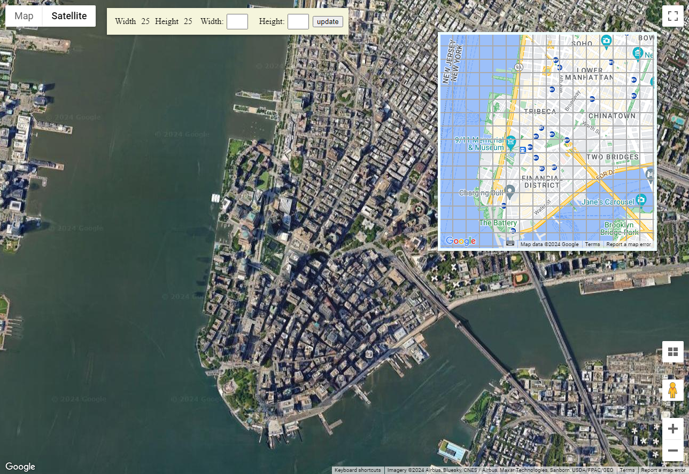
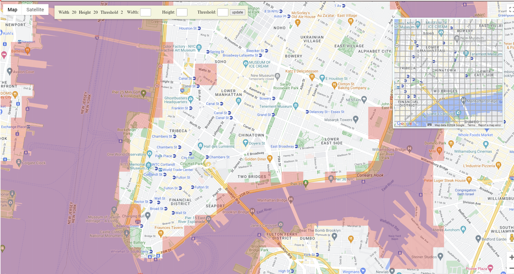

# floodmap

Floodmap is a dynamic project designed to provide users with real-time visualizations of flood levels overlaid on Google Maps. With the ability to visualize flood-prone areas, users can make informed decisions regarding travel routes and understand road conditions during flood events. Empowering users to plan and navigate safely, Floodmap offers a crucial tool in mitigating the impacts of flooding on communities.

## Preview

## Guide

1. Users can adjust the dimensions of the mesh map via the user interface, allowing changes to the width, height, and threshold settings.
2. The threshold represents the elevation level used to determine the presence of a flood.
